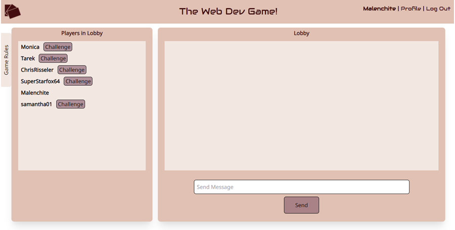

# web-dev-game
[](https://github.com/malenchite/web-dev-game/actions/workflows/main.yml)
[](https://opensource.org/licenses/ISC)
## Description 
A two-player strategy game for building the best web application while developing your IRL dev skills. A full-stack application combining React, Tailwind, MongoDB, Express, Node.js, and socket.io. Players take turns choosing from a set of options, one of which draws a card which will present a question on front-end or back-end web development. A general Lobby chat room is available for players to find each other, and a local chat is provided for each game.

## Table of Contents
* [Installation](#Installation)
* [Usage](#Usage)
* [Testing](#Testing)
* [Screenshots](#Screenshots)
* [Deployment](#Deployment)
* [License](#License)
* [Contributors](#Contributors)
* [Credits](#Credits)

## Installation
Install the application by running this in the main project directory:
```
npm install
```

You must have a MongoDB server running. You may populate questions and cards to the database by running
```
npm run seed
```

## Usage
The application can be started locally with
```
npm start
```

If running locally, this will start both React and Express servers. The React will serve on localhost port 3000, the Express on port 3001.

There are a few environment variables that need to be set for full usage. It is designed for Heroku deployment.
```
AUTH_SECRET = secret salting string for user passwords
MONGODB_URI = full MONGODB path with username and password to an existing database, if not using localhost
REACT_APP_DEPLOYED = set when hosting non-locally to ensure that the front end has the appropriate API paths set
```

## Testing
For testing purposes, you may change the number of turns a game takes to complete by setting the following optional environment variable
```
GAME_OVER_TURN = turn after which the game will end. Should be an even number so each player gets the same amount of turns
```

## Screenshots
  


## Deployment
This application has been deployed on Heroku at https://the-web-dev-game.herokuapp.com

## License  
This application is covered under the **ISC** license. More info can be found here: [ISC](https://opensource.org/licenses/ISC)

## Contributors:
* Chris Risseler
* Christian Wittorp
* Monica Hill
* Samantha Lisk
* Steven Israel
* Tarek Behairy

## Credits
### Major NPM Packages
[Create-React-App](https://www.npmjs.com/package/create-react-app)  
[TailwindCSS](https://www.npmjs.com/package/tailwindcss)  
[Express](https://www.npmjs.com/package/express)  
[Mongoose](https://www.npmjs.com/package/mongoose)  
[Socket.io](https://www.npmjs.com/package/socket.io)  
[Multiavatar](https://www.npmjs.com/package/@multiavatar/multiavatar)

